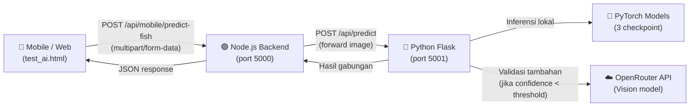
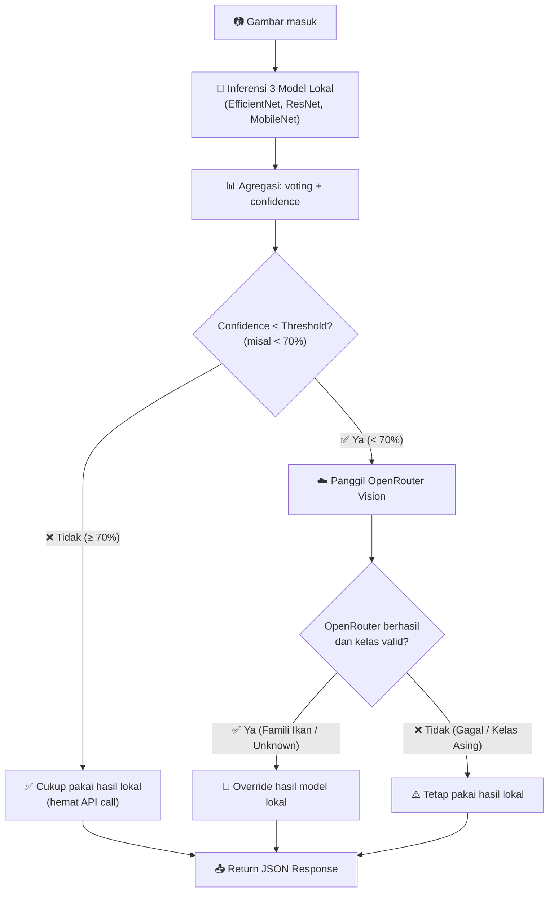
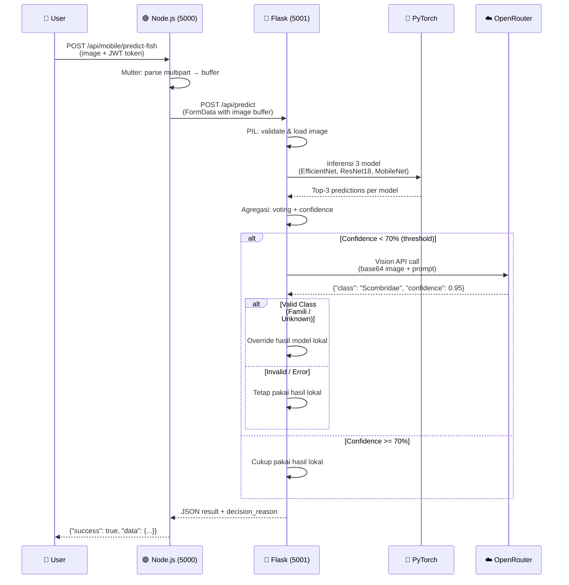

# Dokumentasi Perubahan — Integrasi AI Prediksi Ikan

Dokumen ini merangkum semua perubahan yang dilakukan pada sistem **E-Logbook Maritime** untuk mengintegrasikan fitur prediksi jenis ikan menggunakan **model lokal (PyTorch)** dan **OpenRouter Vision API** sebagai penunjang akurasi.

---

## Arsitektur Sistem



> [!IMPORTANT]
> Sistem berjalan sebagai **dua service terpisah**. Node.js (backend utama) dan Python Flask (AI microservice) harus dijalankan secara **bersamaan** di terminal yang berbeda.

---

## Logika Keputusan OpenRouter (Threshold-Based)

OpenRouter **tidak selalu dipanggil**. Sistem hanya meminta bantuan OpenRouter jika model lokal kurang yakin:



### Pengaturan Threshold

Threshold diatur via variabel `OPENROUTER_THRESHOLD` di file `.env`:

| Nilai | Perilaku |
|-------|----------|
| `70` | **(Default, disarankan)** — OpenRouter dipanggil jika confidence < 70% |
| `50` | Lebih jarang — hanya saat model sangat tidak yakin |
| `90` | Lebih sering — hampir selalu dipanggil |
| `0` | Tidak pernah panggil OpenRouter |
| `100` | Selalu panggil OpenRouter |

---

## File yang Diubah

### 1. Python AI Service

#### [api.py](file:///d:/Tugas%20Kuliah/Semester%206/MBKM%20-%20Magang/Elogbook/Web/backend/model-prediksi/api.py)

**Perubahan utama:**

| Bagian | Sebelum | Sesudah |
|--------|---------|---------|
| **Import** | Hanya `flask`, `PIL` | Ditambah `base64`, `requests`, `os`, `dotenv` |
| **Environment** | Tidak ada | Load `.env` dari folder `backend/` |
| **Checkpoint path** | `checkpoint_path.name` (hanya nama file) | `str(checkpoint_path)` (full path) |
| **Error handling** | `except (UnidentifiedImageError, OSError)` menangkap semua error | Dipisah: error gambar vs error inferensi |
| **OpenRouter** | Tidak ada → Selalu dipanggil | Ditambahkan dengan **threshold-based logic** |
| **Threshold** | — | `OPENROUTER_THRESHOLD` dari `.env` (default 70%) |

**Fix checkpoint path (penyebab utama error 400):**

```diff
 def build_checkpoint_options() -> list[str]:
     options = []
     for checkpoint_path in get_available_checkpoints():
         try:
-            options.append(checkpoint_path.name)
+            options.append(str(checkpoint_path))
         except Exception:
             pass
     return options
```

> [!CAUTION]
> **Bug kritis yang ditemukan:** `checkpoint_path.name` hanya menyimpan nama file (misal `efficientnet_b0_best.pt`), sedangkan `resolve_checkpoint_path()` membutuhkan full path. Akibatnya Python tidak menemukan file model, melempar `FileNotFoundError` (turunan `OSError`), yang **salah ditangkap** dan dilaporkan sebagai "File bukan gambar yang valid atau rusak."

**Fix error handling (dipisah agar tidak menyesatkan):**

```diff
     try:
         image = load_image_bytes(image_bytes)
-
-        model_results = [...]
-        ...
-
-    except (UnidentifiedImageError, OSError):
-        return jsonify({"message": "File bukan gambar yang valid atau rusak."}), 400
-    except Exception as exc:
-        ...
+    except (UnidentifiedImageError, OSError) as exc:
+        logging.error(f"Image load failed: {type(exc).__name__}: {exc}")
+        return jsonify({"message": "File bukan gambar yang valid atau rusak."}), 400
+
+    try:
+        model_results = [...]
+        ...
+    except Exception as exc:
+        logging.exception("Gagal menjalankan inferensi")
+        return jsonify({"message": f"Terjadi kesalahan internal: {str(exc)}"}), 500
```

**Logika threshold OpenRouter:**

```diff
+# Threshold confidence (%) — jika model lokal di bawah ini, panggil OpenRouter
+OPENROUTER_THRESHOLD = float(os.environ.get("OPENROUTER_THRESHOLD", "70"))

     final_result = aggregate_model_results(model_results)
+    local_confidence = float(final_result.get("best_percentage", 0))
+    openrouter_res = None
 
-    # Selalu panggil OpenRouter
-    openrouter_res = call_openrouter_vision(image_bytes, top_k)
+    if local_confidence < OPENROUTER_THRESHOLD:
+        # Confidence rendah → panggil OpenRouter untuk validasi
+        openrouter_res = call_openrouter_vision(image_bytes, top_k)
+        ...
+    else:
+        # Confidence tinggi → cukup pakai model lokal
+        final_result["decision_reason"] = "Confidence sudah di atas threshold"
```

**Fungsi `call_openrouter_vision()`:**

Fungsi ini mengirim gambar ke OpenRouter Vision API untuk validasi silang:

- Encode gambar ke base64
- Kirim ke OpenRouter dengan prompt marine biology
- Jika OpenRouter mengenali famili ikan yang berbeda dari model lokal → **override hasil**
- Model ID dibaca **ketat** dari `OPENROUTER_MODEL` di `.env` (tanpa fallback hardcode)

---

### 2. Node.js Controller

#### [aiController.js](file:///d:/Tugas%20Kuliah/Semester%206/MBKM%20-%20Magang/Elogbook/Web/backend/src/controllers/aiController.js)

```diff
       const response = await axios.post(flaskUrl, formData, {
-        headers: {
-          ...formData.getHeaders(),
-        },
-        timeout: 10000
+        headers: formData.getHeaders(),
+        // Timeout panjang: model loading + inference + OpenRouter call
+        timeout: 60000,
+        maxContentLength: Infinity,
+        maxBodyLength: Infinity
       });
```

| Perubahan | Alasan |
|-----------|--------|
| Timeout `10s` → `60s` | Loading 3 model PyTorch + inferensi + OpenRouter membutuhkan waktu lebih |
| `maxContentLength: Infinity` | Mencegah axios membatasi ukuran response |
| `maxBodyLength: Infinity` | Mencegah axios membatasi ukuran upload |

---

### 3. Konfigurasi Environment

#### [.env](file:///d:/Tugas%20Kuliah/Semester%206/MBKM%20-%20Magang/Elogbook/Web/backend/.env)

Variabel baru yang ditambahkan:

```env
# OpenRouter API Configuration
OPENROUTER_API_KEY="sk-or-v1-xxxxx..."

# Model ID OpenRouter (pilih salah satu)
OPENROUTER_MODEL="google/gemma-4-31b-it:free"
# OPENROUTER_MODEL="nvidia/nemotron-nano-12b-2-vl:free"
# OPENROUTER_MODEL="nvidia/nemotron-3-nano-omni:free"

# Threshold confidence (%) — OpenRouter hanya dipanggil jika model lokal di bawah angka ini
OPENROUTER_THRESHOLD=70
```

> [!WARNING]
> `OPENROUTER_API_KEY` dan `OPENROUTER_MODEL` **wajib diisi**. Jika `OPENROUTER_MODEL` kosong, API akan mengembalikan error eksplisit.

---

### 4. Route Mobile

#### [mobile.js](file:///d:/Tugas%20Kuliah/Semester%206/MBKM%20-%20Magang/Elogbook/Web/backend/src/routes/mobile.js) (baris 2313–2334)

Endpoint `POST /mobile/predict-fish` sudah ada sebelumnya. Tidak ada perubahan pada route, hanya pada controller dan Python service.

```javascript
router.post('/predict-fish', authenticate, (req, res, next) => {
  const upload = multer({
    storage: multer.memoryStorage(),
    limits: { fileSize: 10 * 1024 * 1024 } // 10MB limit
  }).single('image');
  
  upload(req, res, (err) => {
    if (err) {
      return res.status(400).json({ success: false, message: err.message });
    }
    next();
  });
}, aiController.predictFish);
```

---

## Alur Prediksi Lengkap (Sequence Diagram)



---

## Cara Menjalankan

### Terminal 1 — Backend Node.js
```bash
cd backend
npm run dev
```

### Terminal 2 — AI Python Service
```bash
cd backend
npm run start:ai
```

### Terminal 3 — Frontend (opsional)
```bash
cd frontend
npm run dev
```

> [!TIP]
> Untuk testing cepat tanpa frontend, buka `http://localhost:5173/test_ai.html` dan masukkan JWT token dari Swagger UI (`/api-docs`).

---

## Model yang Tersedia

| Model | File | Ukuran |
|-------|------|--------|
| EfficientNet-B0 | `model/efficientnet_b0_best.pt` | ~16 MB |
| MobileNet V3 Small | `model/mobilenet_v3_small_best.pt` | ~6 MB |
| ResNet-18 | `model/resnet18_best.pt` | ~45 MB |

Ketiga model di-run secara berurutan, lalu hasilnya diagregasi dengan sistem **voting + confidence score**.

---

## Famili Ikan yang Dikenali (23 Famili)

| Famili (Scientific) | Nama Lokal |
|---------------------|------------|
| Carangidae | Bawal Hitam / Layang / Selar |
| Cephalopoda | Cumi-cumi |
| Clupeidae | Lemuru / Tembang |
| Dactylopteridae | Sapu-Sapu Laut |
| Engraulidae | Teri |
| Gastropoda | Keong Laut |
| Lutjanidae | Kakap Merah |
| Macrouridae | Ekor Tikus |
| Mugilidae | Belanak |
| Mullidae | Kuniran |
| Myliobatiformes | Pari |
| Nemipteridae | Kurisi |
| Penaeidae | Udang Api |
| Polynemidae | Koro |
| Portunidae | Rajungan |
| Priacanthidae | Swanggi |
| Scombridae | Cakalang / Kembung / Tengiri / Tongkol / Tuna |
| Scorpaenidae | Lepu |
| Selachimorpha | Cucut |
| Serranidae | Kerapu |
| Siganidae | Baronang |
| Stromateidae | Bawal Putih |
| Trichiuridae | Layur |

---

## Contoh Response API

### Kasus 1: Confidence Tinggi (≥ 70%) — Tanpa OpenRouter

```json
{
  "success": true,
  "data": {
    "best_class": "Scombridae",
    "best_display_name": "Cakalang / Kembung / Tengiri / Tongkol / Tuna",
    "best_percentage": 87.45,
    "best_model_name": "efficientnet_b0_best.pt",
    "is_unknown": false,
    "confidence": 0.8745,
    "openrouter_support": false,
    "decision_reason": "Confidence lokal (87.5%) sudah di atas threshold (70.0%), tidak perlu OpenRouter"
  },
  "models": [ ... ],
  "openrouter_raw": null
}
```

### Kasus 2: Confidence Rendah (< 70%) — Dengan OpenRouter

```json
{
  "success": true,
  "data": {
    "best_class": "Lutjanidae",
    "best_display_name": "Kakap Merah",
    "best_percentage": 92.0,
    "best_model_name": "resnet18_best.pt",
    "is_unknown": false,
    "confidence": 0.92,
    "openrouter_support": true,
    "decision_reason": "Confidence lokal (45.3%) di bawah threshold (70.0%), menggunakan OpenRouter untuk validasi"
  },
  "models": [ ... ],
  "openrouter_raw": {
    "class": "Lutjanidae",
    "confidence": 0.92
  }
}
```

> [!NOTE]
> Perhatikan bahwa pada kasus 2, model lokal hanya 45.3% yakin. OpenRouter dipanggil, mengenali ikan sebagai Lutjanidae (Kakap Merah) dengan confidence 92%, lalu **meng-override** hasil model lokal.

---

## Bug yang Diperbaiki

### ❌ Error 400: "File bukan gambar yang valid atau rusak"

**Gejala:** Setiap upload gambar selalu gagal dengan pesan "File bukan gambar yang valid atau rusak", padahal gambarnya valid.

**Akar Masalah:**
1. `build_checkpoint_options()` menyimpan `checkpoint_path.name` (contoh: `"efficientnet_b0_best.pt"`)
2. `resolve_checkpoint_path("efficientnet_b0_best.pt")` mencari di `BASE_DIR/efficientnet_b0_best.pt`
3. File sebenarnya ada di `BASE_DIR/model/efficientnet_b0_best.pt`
4. `FileNotFoundError` (turunan `OSError`) dilempar
5. Blok `except (UnidentifiedImageError, OSError)` **salah menangkap** error ini
6. User melihat pesan "gambar rusak" yang **menyesatkan**

**Perbaikan:**
- Simpan full path: `str(checkpoint_path)` bukan `checkpoint_path.name`
- Pisahkan error handling: validasi gambar di blok `try` sendiri, inferensi di blok `try` terpisah
- Tambahkan logging detail untuk setiap error
